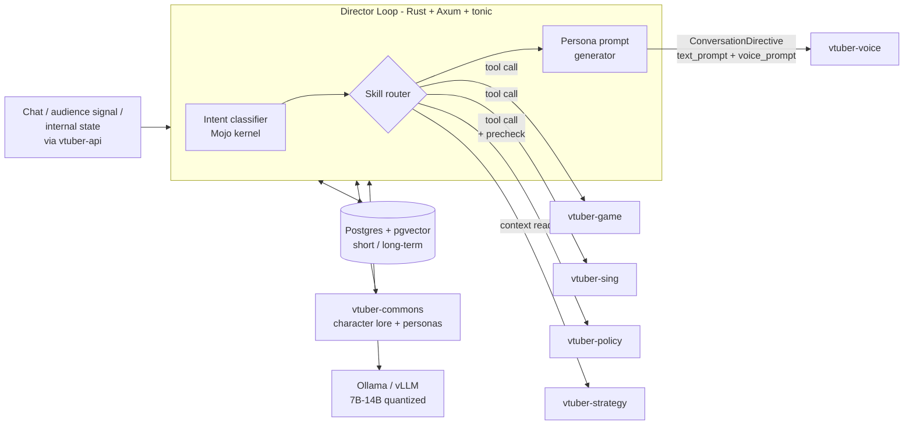

# System Architecture

## 🏗️ High-Level Overview
vtuber-brain is the Director half of the Director/Performer split (ADR-001 in repo_plus.yml). It receives context (chat, audience signal, internal state), runs reasoning and memory retrieval, decides which persona to wear and which skill to invoke, then emits a ConversationDirective containing text_prompt and voice_prompt to vtuber-voice via gRPC. Skills (game/sing/policy/strategy) register as typed tools and brain dispatches via tool-use protocol. Long-term memory lives in Postgres with pgvector; character lore loads from vtuber-commons at startup. Mojo handles hot inference kernels (RAG re-rank, intent classification); Python serves the underlying LLM (Ollama or vLLM).

## 🗺️ Component Diagram

## 🛠️ Technology Stack
- **Programming Languages:** Rust, Mojo, Python
- **Tooling & Infrastructure:** Axum (HTTP), tonic (gRPC), Mojo MAX engine (hot inference kernels — RAG re-rank, intent classification), Ollama / vLLM (LLM serving backend), Postgres + pgvector (short + long-term memory)
- **Core Pattern:** Director / Performer split (brain decides what to think; voice decides how to say it)
- **Strategy:** Per-turn persona text_prompt to PersonaPlex via ConversationDirective. Skills plug in as typed gRPC tool calls. Memory is tiered: short-term per-conversation, long-term in Postgres with pgvector, character lore from vtuber-commons.

## 🔗 Internal References
- Engineering rules: [PRINCIPLES.md](PRINCIPLES.md)
- Live project map: [STRUCTURE.tree](STRUCTURE.tree)
